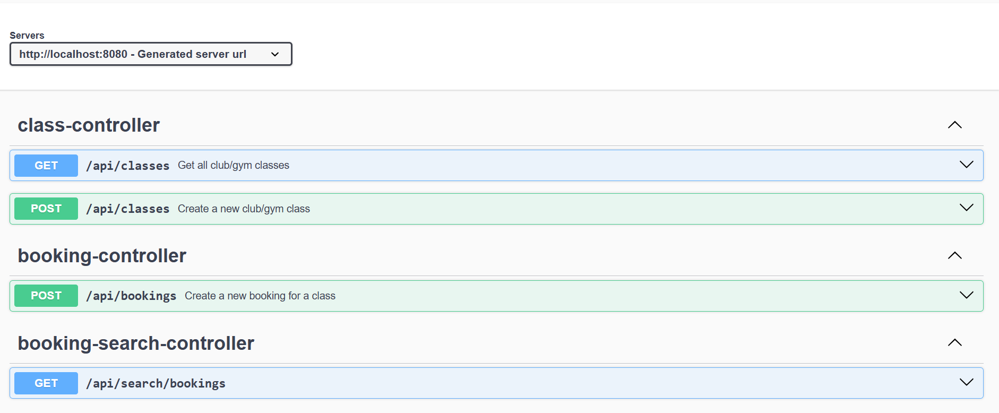

# ABC Ignite - Gym Management System

## Overview

ABC Ignite is a Gym Management System designed to manage gym classes, bookings, and search functionalities. It allows gym owners to create classes, manage bookings, and search bookings by member or date range. This system provides a RESTful API that does not require UI at this time and stores data in-memory for simplicity. This project is built using **Spring Boot** with a clean architecture adhering to SOLID principles.

### Key Features

- **Create Classes**: Gym owners can create classes with attributes like name, start date, end date, start time, duration, and capacity.
- **Book Classes**: Members can book a class for a specific participation date. A member can book multiple classes for the same day.
- **Search Bookings**: Gym owners can search for bookings by member name or date range.

## Project Structure

```

 src/
 ├── main/
 │    ├── java/
 │    │    ├── com/
 │    │    │    ├── abc-ignite/              # Root package for the application
 │    │    │    │    ├── config/               # Configuration classes (e.g., CORS, Beans, Properties)
 │    │    │    │    ├── controller/           # REST API controllers (handle HTTP requests)
 │    │    │    │    ├── dto/                  # Data Transfer Objects (used for request/response payloads)
 │    │    │    │    ├── exceptions/           # Custom exception handling (e.g., GlobalExceptionHandler)
 │    │    │    │    ├── model/                # Domain models (entities like Class, Booking)
 │    │    │    │    ├── repository/           # Repository interfaces for data persistence
 │    │    │    │    ├── service/              # Business logic layer (implements service interfaces)
 │    │    │    │    └── ABCIgniteApplication.java  # Main class (Spring Boot entry point)
 │    └── resources/
 │         ├── application.properties          # Application configurations (database, logging, etc.)
 └── test/                                     # Unit tests

```

## Prerequisites

Before deploying or testing the service, ensure you have the following installed:

- **Java 17+**: ABC Ignite requires Java 17 or higher.
- **Maven**: Dependency management and building the application.
- **Git**: For cloning the repository and version control.
- **Eclipse IDE**: For loading and running the application.

## Steps to Deploy the Service

1. **Clone the repository:**
   Open your terminal and clone the repository.

   ```bash
   git clone https://github.com/kollampst/ABCIgniteCMS.git
   cd abc-ignite
   ```

2. **Build the project:**
   Use Maven to build the project and resolve dependencies.

   ```bash
   mvn clean install
   ```

3. **Run the application:**
   You can run the application using Maven.

   ```bash
   mvn spring-boot:run
   ```

   Alternatively, you can run the Spring Boot application using the `ABCIgniteApplication` class in your IDE.

4. **Access the API:**
   Once the application is running, the API is available at `http://localhost:8080`. You can use tools like **Postman** or **cURL** or **Swagger** to interact with the API.
   Note: Swagger URL - http://localhost:8080/swagger-ui/index.html

## Available Endpoints

1. **Create Class:**

   - **POST** `/api/classes`
   - Request Body:
   ```json
    {
        "name": "Yoga Class",
        "startDate": "2025-02-08",
        "endDate": "2025-02-15",
        "startTime": "10:00",
        "duration": 60,
        "capacity": 30
    }
   ```
   - Description: Create a new class with the specified parameters.

2. **Book a Class:**

   - **POST** `/api/bookings`
   - Request Body:
   ```json
    {
        "memberName": "Sai K",
        "className": "Yoga Class",
        "participationDate": "2025-02-04"
    }
   ```
   - Description: Book a spot for a member in the class for a given participation date.

3. **Search Bookings:**

   - **GET** `/api/search/bookings`
   - Parameters:
     - `memberName` (optional) - Search bookings by member name.
     - `startDate` (optional) - Start date for the search.
     - `endDate` (optional) - End date for the search.
   - Example URL: `http://localhost:8080/api/bookings?memberName=Sai K`
   - Description: Search bookings by member or by a date range.

## Testing the Application

### Unit Tests

We have written unit tests for the services and controllers to ensure proper functionality.

1. **Run the tests using Maven:**

   ```bash
   mvn test
   ```

2. **Tests include:**
   - **BookingServiceTest**: Tests for booking functionality.
   - **ClassServiceTest**: Tests for class creation functionality.
   - **BookingSearchServiceTest**: Tests for searching bookings by member and date range.
   - **ClassControllerTest**: Tests for REST controller to validate APIs.
   - **Others**: Other tests for all the classes.

## Configuration

### application.properties

You can configure application-specific settings in `src/main/resources/application.properties`. 

Currently, the application doesn't need complex configurations as it uses in-memory storage for classes and bookings.

## Troubleshooting

- **Java version compatibility**: Ensure you have Java 17 or above installed.
- **Port conflict**: If port `8080` is in use, modify the `server.port` in `application.properties` to a different port.

### Conclusion

ABC Ignite provides a scalable and modular solution for gym owners to manage classes and bookings efficiently. With the built-in REST API, it can be integrated into other systems or used as a standalone service for gym management.


